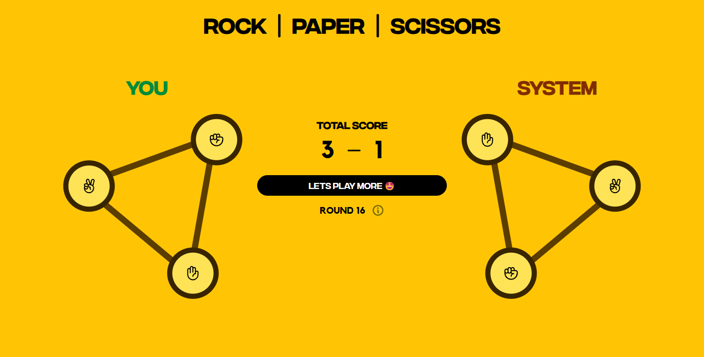
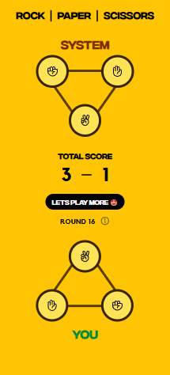

# Rock Paper Scissors 🎮✊📄✂️

An interactive, browser-based Rock Paper Scissors game with a modern UI, responsive layout, and smooth game flow. Originally built in October 2024, this project was fully redesigned on July 1, 2025.

🌐 **[Live Demo »](https://muhamedrazik-2003.github.io/rock-paper-scissors/)**  
📂 **[View Source Code »](https://github.com/muhamedrazik-2003/rock-paper-scissors)**

---

## 📌 Features

- 🧠 Computer generates random choices using `Math.random() * 3`
- 🥇 First to reach 5 points wins the game
- 💡 Real-time feedback after each round (win/lose/draw)
- 🪟 Game over popup with a replay option
- 🎨 Colored border indicators for win/loss/draw status
- 📱 Fully responsive layout for desktop and mobile
- 🧑‍🎨 Custom fonts and styled buttons

---

## 📆 Development Timeline

- **Initial Version:** October 2024  
  - Basic layout: score, buttons (rock, paper, scissors), result display  
  - Functionality based on simple DOM updates  
  - Static vertical stacking of containers  

- **Redesigned:** July 1, 2025  
  - Entire layout restructured for better visual flow  
  - Responsive design with improved typography and spacing  
  - Added feedback visuals through `gameStatusIndicator()`  
  - Game Over screen with proper outcome messages  
  - Improved animations and mobile compatibility

---

## 🧩 Technologies Used

- **HTML** – Semantic structure  
- **CSS** – Custom animations, layout design, media queries  
- **JavaScript** – Game logic, DOM manipulation, interactivity

---

## 💻 Screenshots

### Old Version:
⚠️ *Screenshot not available — the old version used a basic vertical layout with stacked containers for score, options, and result.*

### Redesigned Version:

---
👤 Author
Muhamed Razik
Frontend Developer | MERN Stack Enthusiast
